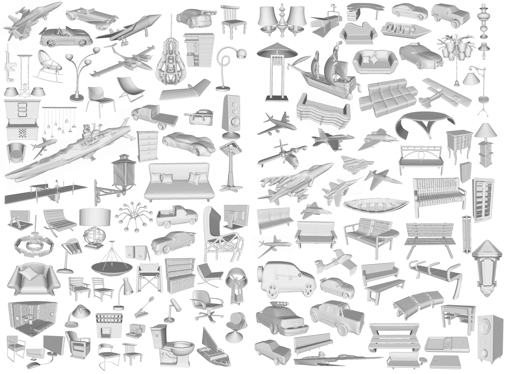

# DMNet: Delaunay Meshing Network for 3D Shape Representation (ICCV 2023)
PyTorch implementation of the paper:  

[DMNet: Delaunay Meshing Network for 3D Shape Representation](https://openaccess.thecvf.com/content/ICCV2023/papers/Zhang_DMNet_Delaunay_Meshing_Network_for_3D_Shape_Representation_ICCV_2023_paper.pdf)  

Chen Zhang, Ganzhangqin Yuan, Wenbing Tao*



## Setup  
Python package requirements (other similar versions are also acceptable).  
```
python == 3.9
pytorch == 1.12.1
yaml
```
In addition, you also need to install some C++ libraries.  
```
Open3D == 0.16
CGAL
boost
libgmp-dev
```

## Compiling
Our network is only used to generate tetrahedral labels, so you need to compile two programs.  
- Compile the executable program to process data.
```
cd create_gt
mkdir build
cd build
cmake ../
make
```
- Compile the executable program to generate the mesh.
```
cd create_mesh
mkdir build
cd build
cmake ../
make
```

## Quick Test
There is some processed data in the `example` folder for reference.  
First, generate the preprocessed data based on the point cloud and mesh (if only for testing, mesh can be arbitrary; for training, use the GT mesh). `example/processed_data` is the output folder.
```
cd create_gt
python run.py
python data_process.py
```
Second, run the network to generate labels. `example/exp/output_label` is the output folder.
```
cd network
# modify test_name.txt
python test_pro.py
```
Finally, generate final mesh, which will be stored in the `example/exp/output_mesh` folder. 
```
cd create_mesh
python run.py
```

## Training and Tips
You can use the [ShapeNet](https://shapenet.org/) dataset (processed watertight shapes can be provided by [SAP](https://github.com/autonomousvision/shape_as_points)) for training. 
Sample the points, generate the preprocessed data, and then train the network.
```
cd network
# modify train_name.txt, val_name.txt
python train_pro.py
```
1. The network parameters can be adjusted to reduce GPU memory usage.  
2. For noisy points, please retrain the model and apply smoothing to the final mesh, such as using the `filter_smooth_laplacian` function in open3d-python.


## Citation
```
@inproceedings{zhang2023dmnet,
  title={Dmnet: Delaunay meshing network for 3d shape representation},
  author={Zhang, Chen and Yuan, Ganzhangqin and Tao, Wenbing},
  booktitle={2023 IEEE/CVF international conference on computer vision (ICCV)},
  pages={14372--14382},
  year={2023},
  organization={IEEE Computer Society}
}
```
